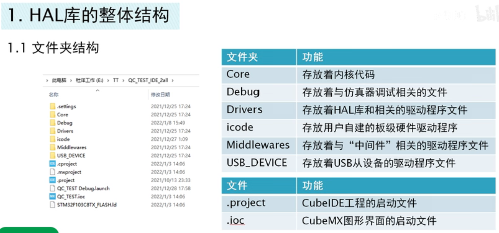
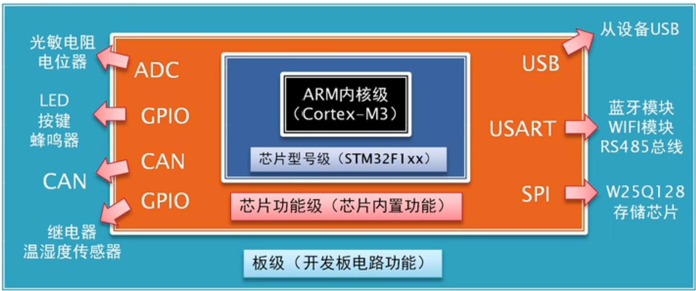

# 工程结构 

<!-- @import "[TOC]" {cmd="toc" depthFrom=1 depthTo=6 orderedList=false} -->

<!-- code_chunk_output -->

- [工程结构](#工程结构)
  - [1 文件结构](#1-文件结构)
  - [2 单个文件结构](#2-单个文件结构)

<!-- /code_chunk_output -->

## 1 文件结构 

**值得注意的使Drivers使官方提供的底层协议库驱动，图中的icode使自己提供的板级硬件层驱动，外设驱动**
**我们应该每次撰写外设驱动，专门放在一个文件夹养成良好的开发习惯**

## 2 单个文件结构  

**我们可以展开每一个文件。方便知晓文件的结构**

再细致一点，我们甚至可以单击跳转该文件中的任意定义

（#if,#endif宏定义判断是否编译）

**从该处获得灵感，我们的程序也可以添加#if语句来提高效率**