# STM32串口通讯  

<!-- @import "[TOC]" {cmd="toc" depthFrom=1 depthTo=6 orderedList=false} -->

<!-- code_chunk_output -->

- [STM32串口通讯](#stm32串口通讯)
  - [1 串口通讯的类型](#1-串口通讯的类型)
  - [2 运行机制](#2-运行机制)
    - [2.1 轮询模式](#21-轮询模式)
      - [2.1.1 轮询发送](#211-轮询发送)
      - [2.1.2 轮询接收](#212-轮询接收)
    - [2.2 中断模式](#22-中断模式)
      - [2.2.1 中断模式发送](#221-中断模式发送)
      - [2.2.2 中断模式接收](#222-中断模式接收)
      - [2.3 DMA机制](#23-dma机制)
        - [2.3.1 DMA 不定长数据接收实现](#231-dma-不定长数据接收实现)

<!-- /code_chunk_output -->
---

## 1 串口通讯的类型 

1. 轮询模式
2. 中断模式
3. DMA模式


## 2 运行机制

### 2.1 轮询模式

#### 2.1.1 轮询发送
STM32每个串口内部具有两个寄存器
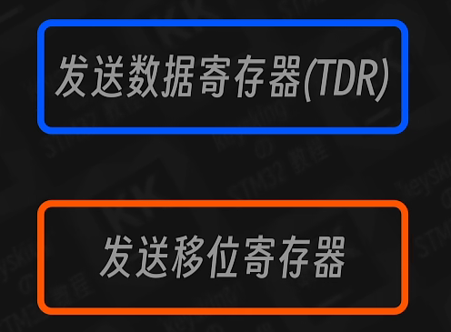
1. 发送数据寄存器（储存即将发送的数据）
2. 发送移位寄存器（将数据按照约定的波特率转化成高低电平）

CPU一直在查询发送数据寄存器中的数据有没有发送到发送移位寄存器中，不停的查询数据，所以轮询模式下CPU需要一直参与，因而需要约定超时时间。
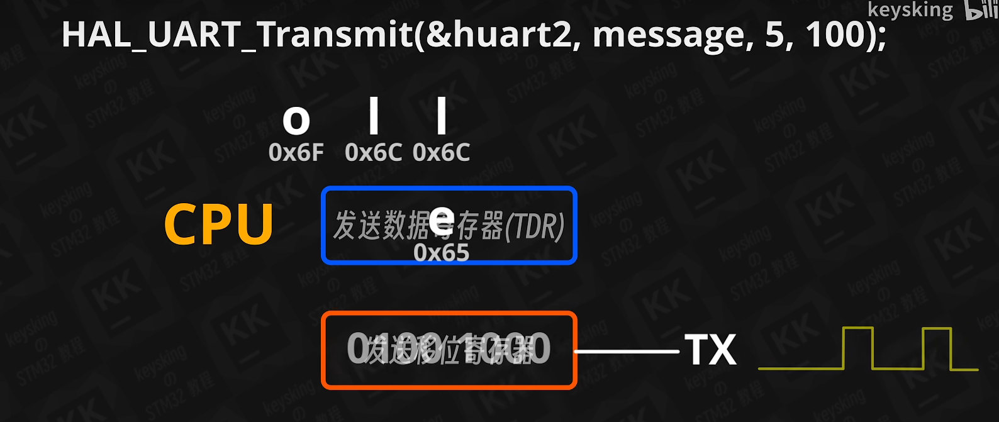

#### 2.1.2 轮询接收 

STM32的串口接收也有两个寄存器。
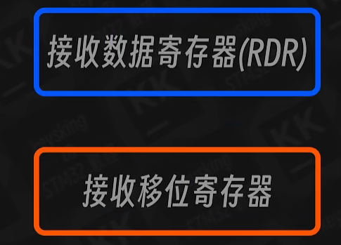

和发送一样CPU也需要一直查询接收数据寄存器中的数据有没有数据可以读取，

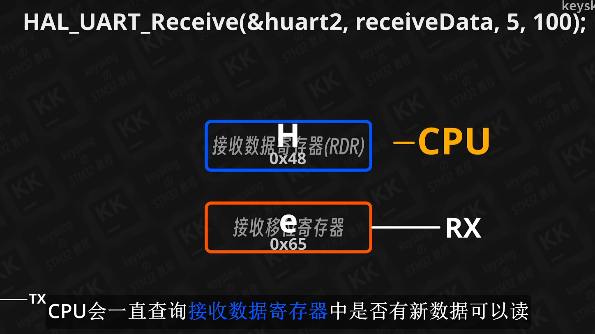

**我们称这种CPU一直处理串口的叫做`堵塞`**

为了解决这个堵塞问题我们可以使用中断模式。

### 2.2 中断模式 

#### 2.2.1 中断模式发送

CPU将数据塞入寄存器之后可以处理其他任务，当`发送数据寄存器`空时触发中断把CPU叫回来，CPU再塞入数据，然后再去处理其他代码。
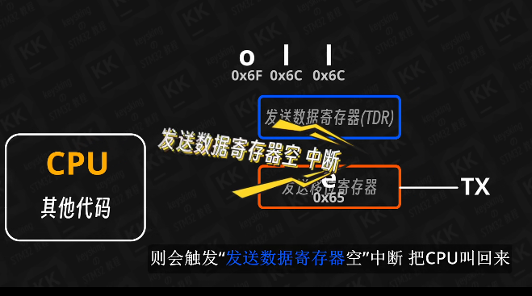
==中断模式下CPU不会堵塞，不需要设置超时时间==

```c
  HAL_UART_Transmit_IT(&huart2,receiveData,2);

```

宏观模式下可能没有明显变化。

#### 2.2.2 中断模式接收  

```c
HAL_UART_Receive_IT(UART_HandleTypeDef *huart, uint8_t *pData, uint16_t Size);
//串口中断接收数据
```
UART_HandleTypeDef * huart：串口号
uint8_t * pData：存放数据的数组
uint16_t Size：接收的数据长度
设置数据存放位置，接收数据长度，然后使能串口接收中断。接收到数据时，会触发串口中断，再然后，串口中断函数处理，直到接收到指定长度数据，而后关闭中断，进入中断接收回调函数，不再触发接收中断。(只触发一次中断)

**需要注意的是，由于中断模式没有超时时间，开启即会一直执行，所以不要放在循环之中，否则下次循环开启的时候数据可能并未接收完成。**

**由于没有超时时间，因此我们还需要知道什么时候数据接收完成。**

我们可以使用中断处理函数函数解决这个问题。

HAL库已经初始化了中断函数逻辑
```c
  USART2_IRQHandler();
```
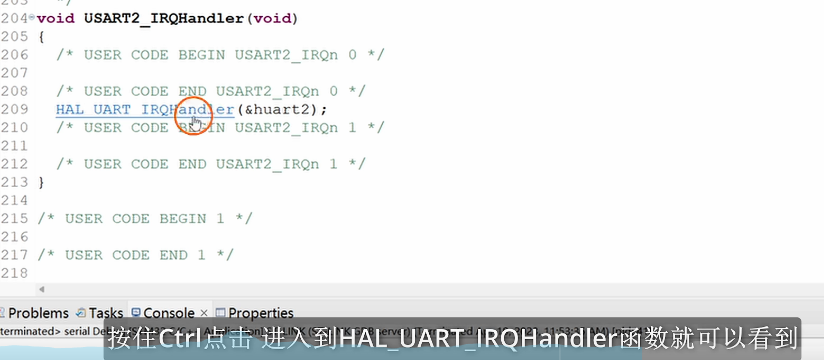

我们需要在复杂的逻辑之中如何插入执行我们的代码呢？
HAL库可以调用`回调函数`机制（Callback：当有事件发生的时候就会调用这个函数。）

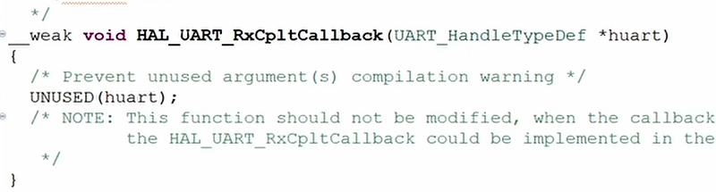

接收完成会触发一个中断，
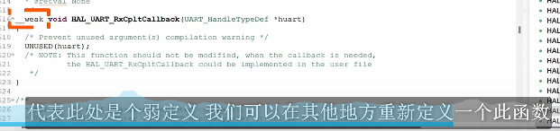
由于__weak弱定义存在因此我们可以重新定义。（有定义则弱定义不编译）

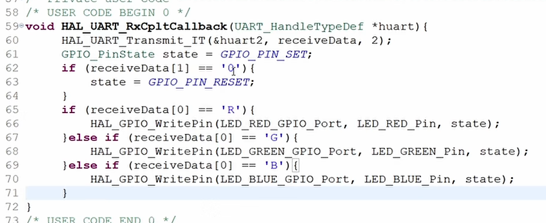
**我们的逻辑可以放到这里**

注意由于中断接收结束会关闭所以函数尾需要添加重新开启
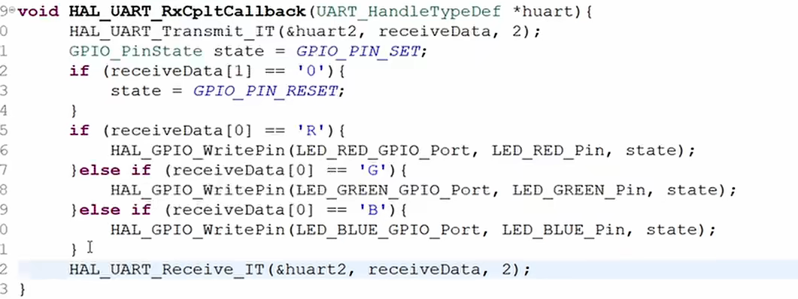

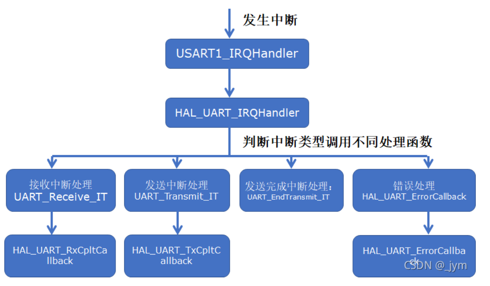


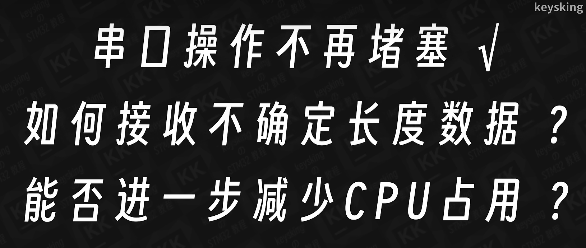

为了解决这些问题，我们可以使用DMA

#### 2.3 DMA机制 

DMA全称为：Direct Memory Access 直接内存访问。

我们创建了通道，只需要告诉DMA将数据从哪里搬到哪里就可以。


##### 2.3.1 DMA 不定长数据接收实现

>资料：https://blog.csdn.net/as480133937/article/details/104827639
>资料：https://blog.csdn.net/as480133937/article/details/105013368

**以来串口空闲中断来触发中断**

