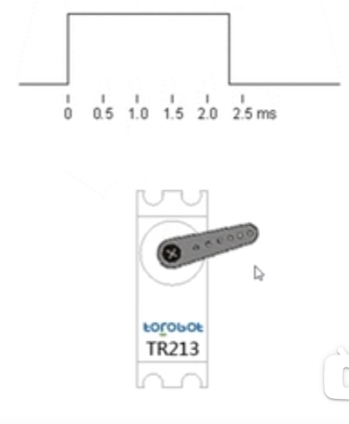
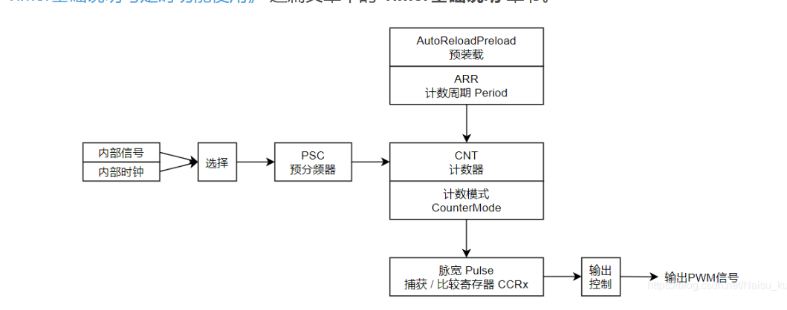
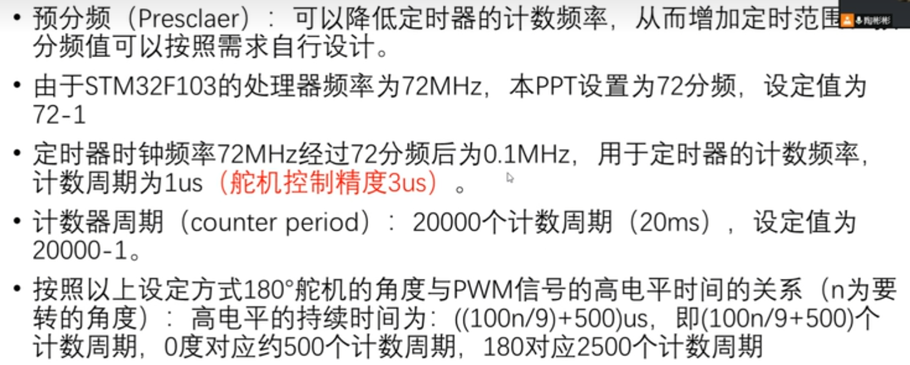
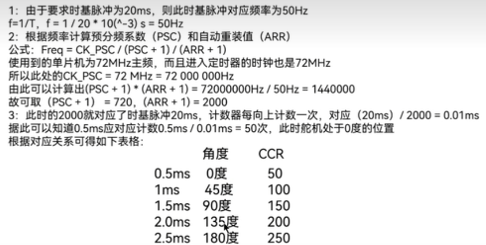
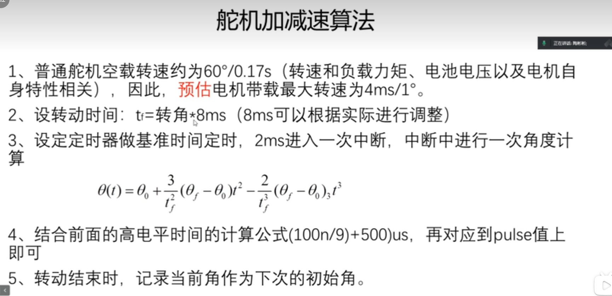

# 控制舵机

<!-- @import "[TOC]" {cmd="toc" depthFrom=1 depthTo=6 orderedList=false} -->

<!-- code_chunk_output -->

- [控制舵机](#控制舵机)
  - [0 学习资料](#0-学习资料)
  - [1 舵机介绍](#1-舵机介绍)
  - [2 HAL库配置](#2-hal库配置)
    - [2.1 生成20msPWM信号](#21-生成20mspwm信号)
  - [3 舵机控制算法](#3-舵机控制算法)
    - [3.1 加减速算法](#31-加减速算法)
  - [4 需要特别注意的事项](#4-需要特别注意的事项)

<!-- /code_chunk_output -->

---

## 0 学习资料  

>https://www.bilibili.com/video/BV1de411M7uf/?spm_id_from=333.337.search-card.all.click&vd_source=a3783e84d880b6ffb4a798de09eea520

## 1 舵机介绍  

舵机需要一个20ms的信号来控制角度

## 2 HAL库配置

### 2.1 生成20msPWM信号

1. 预分频(PSC)产生1MHz，时基脉冲为1$\mu s$,参数设置为72-1
2. 设置计数周期(ARR) 因为需要周期为$20ms$所以计数周期为$\frac{20ms}{1\mu s}=20000-1$，计数周期为$1\mu s$ 
3. 根据需要的角度对应计数周期数量 

|     | 角度 | CCR |
|-----|------|-----|
| 0.5ms | 0度  | 500 |
| 1ms   | 45度 | 1000 |

按照上面的配置终止$0.1ms\Leftrightarrow 9 度\Leftrightarrow 100CCR$

## 3 舵机控制算法 

### 3.1 加减速算法 

## 4 需要特别注意的事项

1. 零点初始化（拿到舵机在安装前一定要确定零点，否则机械结构限制无法转动会烧毁舵机）
2. 设定角度后给硬件反应延迟，等待舵机完成转动。